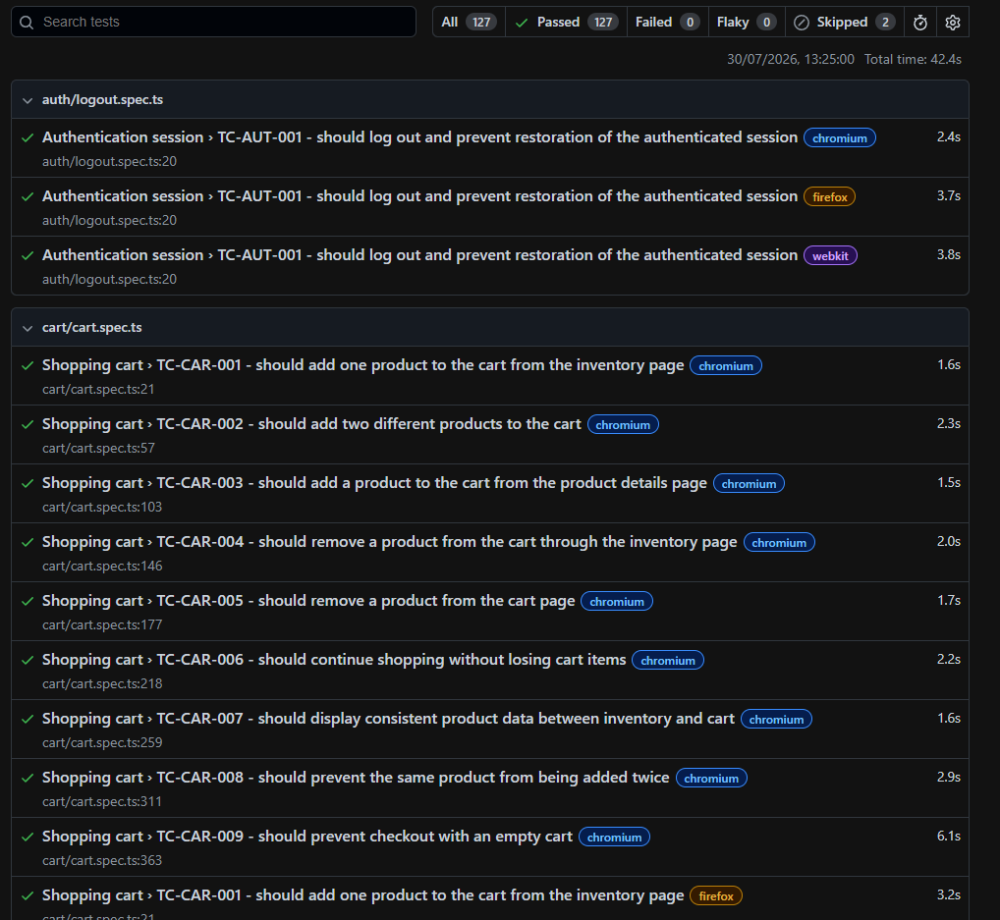

# Test Execution Report

## 1. Overview

This document records the latest validated local and CI regression executions of the SauceDemo end-to-end automation suite.

| Field | Value |
|---|---|
| Application | SauceDemo |
| Execution date | 2026-07-30 |
| Execution type | Full cross-browser regression |
| Local command | `npx playwright test` |
| Browsers | Chromium, Firefox, and WebKit |
| Playwright dependency | `@playwright/test` `^1.62.0` |
| Local environment | Windows PowerShell |
| CI environment | GitHub Actions on `ubuntu-latest` |
| Final status | Passed with documented expected failures and skips |

## 2. Objective

The execution validated the main e-commerce flows covered by the project:

- login and authentication session;
- product inventory and sorting;
- shopping cart operations;
- checkout information validation;
- checkout overview and calculations;
- purchase completion;
- side menu navigation;
- Reset App State behavior.

The goal was to confirm that the full suite remained stable locally and through continuous integration after the authenticated fixture refactoring, traceability documentation, and GitHub Actions configuration.

## 3. Execution Summary

### Local Regression

| Metric | Result |
|---|---:|
| Automated test cases | 43 |
| Specification files | 8 |
| Configured executions | 129 |
| Regular passes | 116 |
| Expected failures | 11 |
| Skipped executions | 2 |
| Unexpected failures | 0 |
| Playwright summary | 127 passed, 2 skipped |
| Execution time | 47.0 seconds |

### CI Regression

| Metric | Result |
|---|---:|
| Workflow | `Playwright Tests` |
| Job | `Cross-browser regression` |
| Branch | `main` |
| Runner | `ubuntu-latest` |
| Node.js | 24 |
| Configured executions | 129 |
| Playwright summary | 127 passed, 2 skipped |
| Unexpected failures | 0 |
| Execution time | Approximately 3.4 minutes |
| Workflow status | Passed |
| Generated artifact | `playwright-report` |
| Artifact retention | 30 days |

> Playwright includes expected failures in the displayed `passed` total. Therefore, the `127 passed` summary consists of 116 regular passes and 11 expected failures.

## 4. Expected Failures

The following scenarios intentionally use conditional expected-failure monitoring because the current application behavior differs from the expected rule or remains under investigation.

| Test ID | Browser executions | Classification | Observed behavior |
|---|---:|---|---|
| TC-CAR-009 | 3 | Known defect | Checkout can start with an empty cart. |
| TC-CHK1-007 | 3 | Known defect | Required checkout fields accept whitespace-only values. |
| TC-CHK1-008 | 3 | Known limitation under investigation | Postal code accepts non-numeric values and special characters. |
| TC-RST-001 | 2 | Known defect | Reset App State clears the cart but does not immediately refresh the product action buttons. |
| **Total** | **11** |  |  |

These results are accepted by the suite only when the monitored behavior is reached. Failures during setup, navigation, or unrelated assertions are not masked as expected failures.

## 5. Skipped Executions

| Test ID | Browser | Reason |
|---|---|---|
| TC-RST-001 | WebKit | SauceDemo side menu may not open reliably after cart state changes. |
| TC-RST-002 | WebKit | SauceDemo side menu may not open reliably after cart state changes. |

The WebKit limitation was previously investigated and documented. The scenarios remain active in Chromium and Firefox.

## 6. Result by Feature

| Feature | Test cases | Configured executions | Current result |
|---|---:|---:|---|
| Login | 7 | 21 | Passed |
| Authentication session | 1 | 3 | Passed |
| Inventory | 6 | 18 | Passed |
| Shopping cart | 9 | 27 | Passed with 3 expected failures |
| Checkout information | 8 | 24 | Passed with 6 expected failures |
| Checkout overview and confirmation | 7 | 21 | Passed |
| Side menu navigation | 3 | 9 | Passed |
| Reset App State | 2 | 6 | 2 regular passes, 2 expected failures, and 2 skips |
| **Total** | **43** | **129** | **0 unexpected failures** |

## 7. Generated Report and Runtime Evidence

### Versioned Local Execution Evidence



The screenshot above was captured from the Playwright HTML report generated by the validated full local regression.

### GitHub Actions Execution

The test suite was also validated through the `Playwright Tests` GitHub Actions workflow.

| Field | Result |
|---|---|
| Branch | `main` |
| Runner | `ubuntu-latest` |
| Node.js | 24 |
| Job | `Cross-browser regression` |
| Configured executions | 129 |
| Playwright summary | 127 passed, 2 skipped |
| Unexpected failures | 0 |
| Execution time | Approximately 3.4 minutes |
| Workflow status | Passed |
| Generated artifact | `playwright-report` |
| Artifact retention | 30 days |

The CI execution completed successfully, and the generated Playwright HTML report was uploaded as a downloadable workflow artifact.

### Local Report Generation

The Playwright configuration generates:

- list output in the terminal;
- an HTML report in `playwright-report/index.html`;
- screenshots only on unexpected failure;
- videos retained on unexpected failure;
- traces on the first retry.

The generated report directories are intentionally ignored by Git:

```text
/test-results/
/playwright-report/
/blob-report/
```

This prevents generated runtime files from unnecessarily increasing the repository size.

The latest local HTML report can be opened with:

```bash
npm run report
```

or:

```bash
npx playwright show-report
```

Because the latest local execution had no unexpected failures and local retries are disabled, screenshots, videos, and traces were not expected to be generated for this run.

## 8. Conclusion

The full local and CI regressions completed without unexpected failures.

The suite successfully validated the intended cross-browser coverage while continuing to monitor known application defects and limitations. The authenticated fixture did not change the number of automated scenarios or the expected test outcomes.

The current result provides evidence that the project contains:

- independent automated tests;
- reusable authentication setup;
- cross-browser execution;
- positive, negative, alternative, and state-management scenarios;
- calculation and data-consistency validations;
- explicit handling of known defects;
- documented browser-specific limitations;
- continuous integration with GitHub Actions;
- downloadable Playwright HTML reports as CI artifacts.

## 9. Current Limitations

- The tested application is a public third-party demonstration environment.
- Application availability and behavior are outside this repository's control.
- Two Reset App State executions remain skipped in WebKit.
- The invalid postal-code behavior requires product requirements before final defect classification.
- GitHub Actions artifacts are retained for 30 days and must be downloaded before expiration.

## 10. Next Actions

- validate installation and execution from a clean clone;
- review all README commands and internal links;
- execute the final cross-browser regression;
- complete the final repository review.
